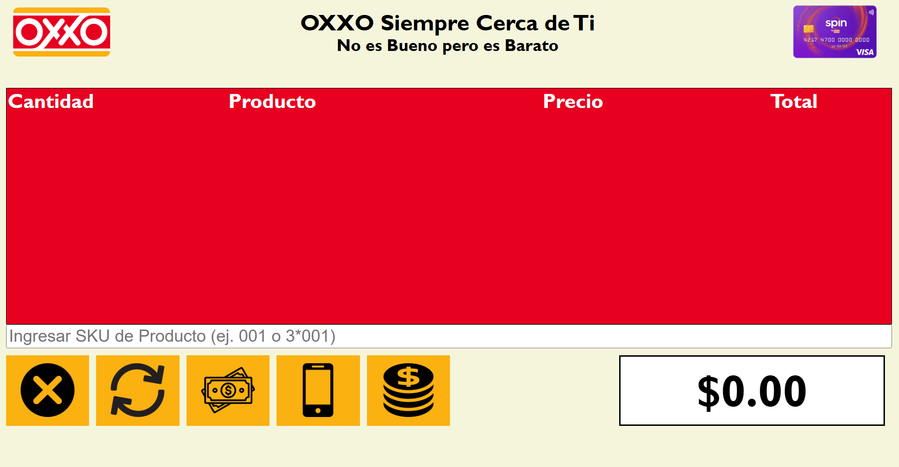
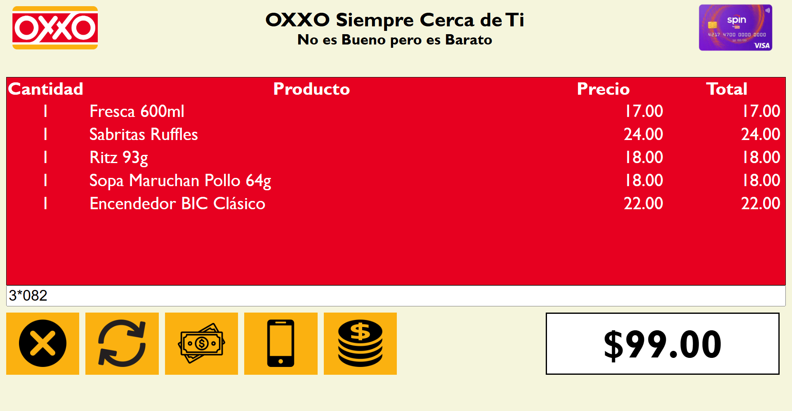
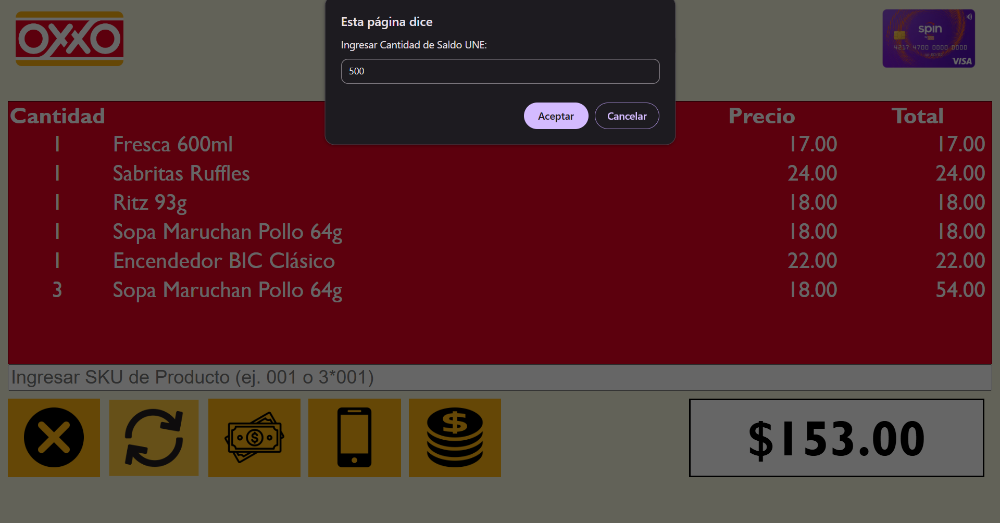
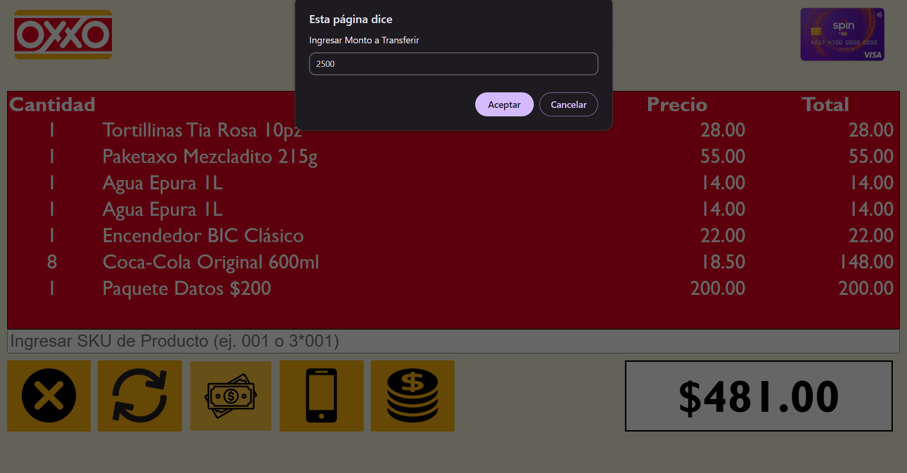
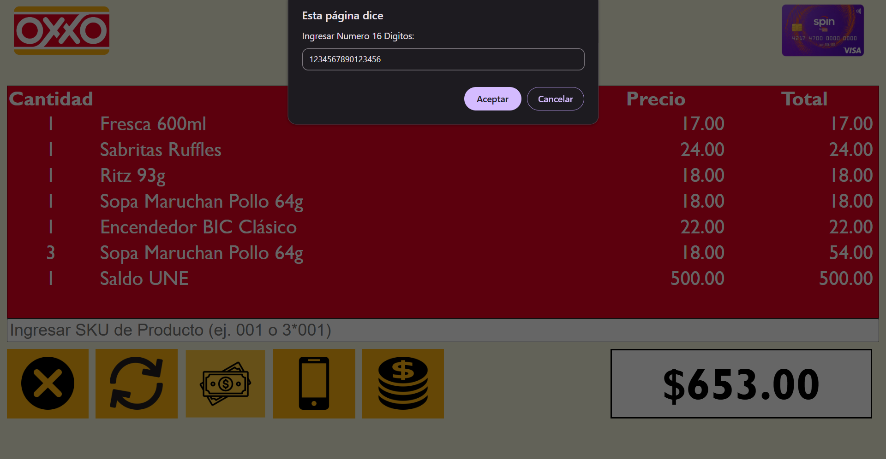
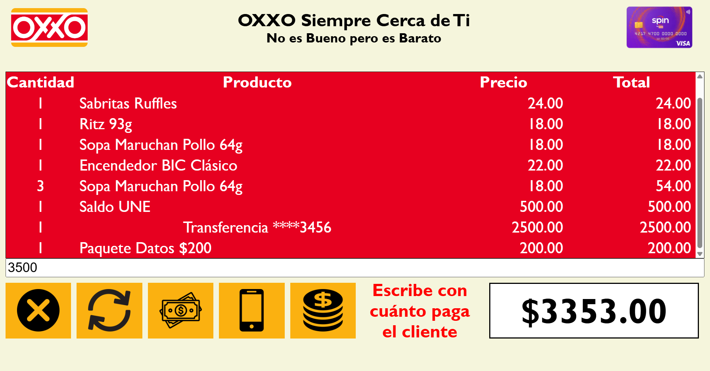
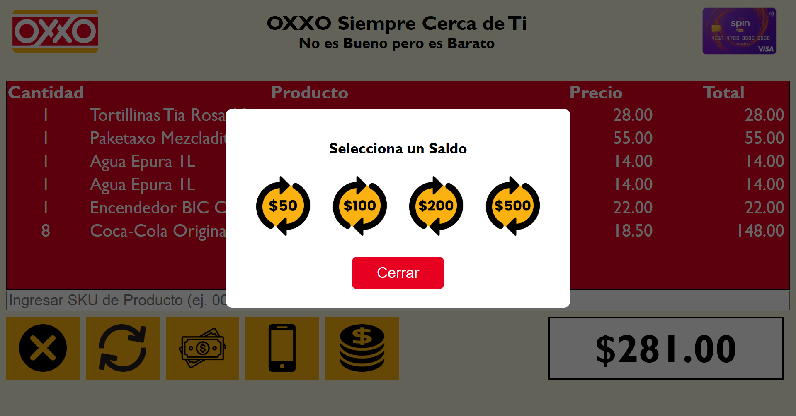
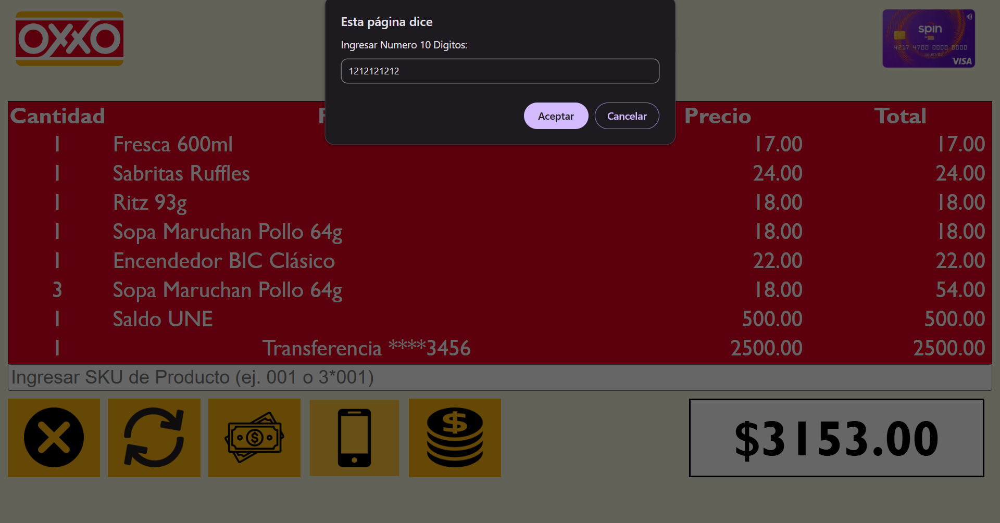
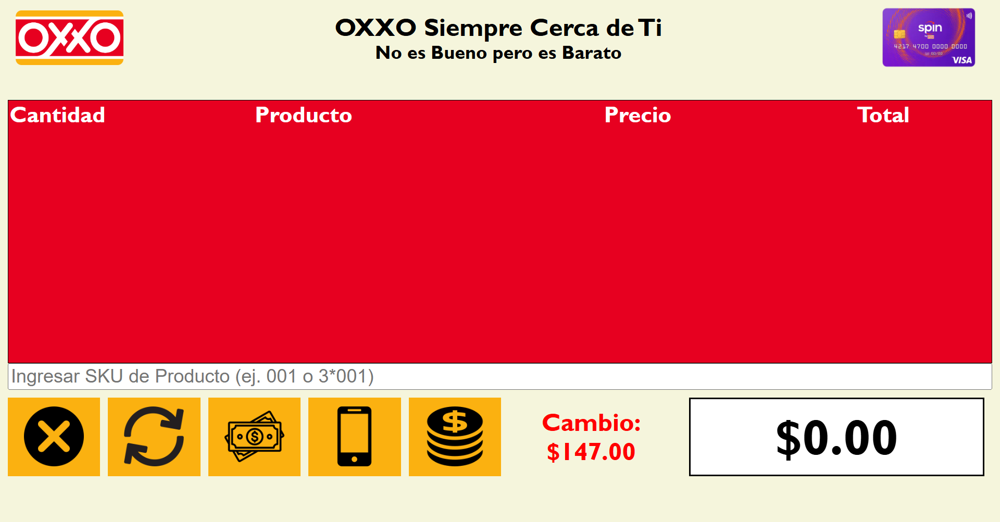

# Simulador de PoS OXXO

## Creador

- **[Antuan Carpio]** – GitHub: [@antuancarpio](https://github.com/antuancarpio)

## Descripción

Simulador de punto de venta (PoS) estilo OXXO que funciona en el navegador. Permite registrar una venta capturando el SKU de los productos, ver el carrito con su total, y realizar operaciones de servicios como recargas, transferencias y paquetes de datos.

### ¿Cómo se usa?

- **Agregar un producto:** escribe su SKU (del `001` al `100`) en el campo de texto y presiona `Enter`.
- **Agregar varias piezas:** usa el formato `cantidad*SKU`, por ejemplo `3*001`.
- **Carrito:** la tabla muestra cantidad, producto, precio y total de cada renglón, y el total general aparece abajo a la derecha.
- **Botones de la parte inferior (de izquierda a derecha):**
  - **Cancelar venta:** vacía el carrito y reinicia el total.
  - **Saldo UNE:** pide un monto y lo agrega a la venta.
  - **Transferencia:** pide un número de tarjeta de 16 dígitos y un monto; en el carrito solo se muestran los últimos 4 dígitos.
  - **Paquetes de datos:** pide un número de 10 dígitos y abre una ventana para elegir un paquete de $50, $100, $200 o $500.
  - **Pagar:** escribe con cuánto paga el cliente en el campo de texto y presiona este botón; el sistema muestra el cambio o cuánto falta.
- **Mensajes:** el sistema avisa si el producto no existe, si la cantidad es inválida o si faltan datos para cobrar.

## Tecnologías

- HTML5
- CSS3
- JavaScript

## Instrucciones de uso

No requiere instalación ni configuración. Solo necesitas un navegador web.

1. Descarga el proyecto (botón **Code → Download ZIP**) o clónalo con Git.
2. Entra a la carpeta del proyecto.
3. Abre el archivo `index.html` en tu navegador (doble clic o arrastrándolo a una ventana del navegador).

## Imágenes

